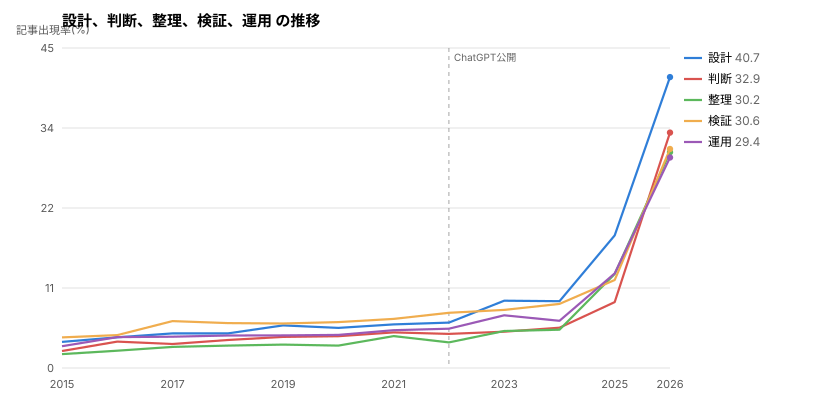
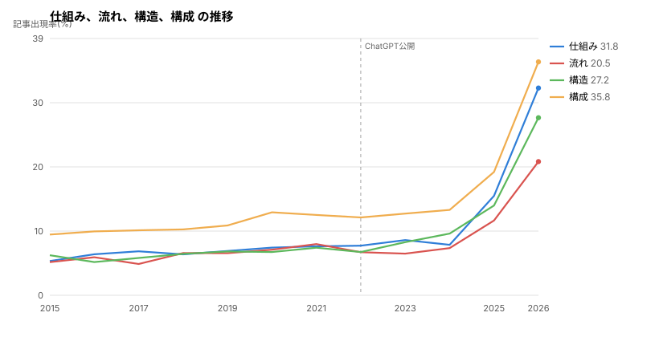
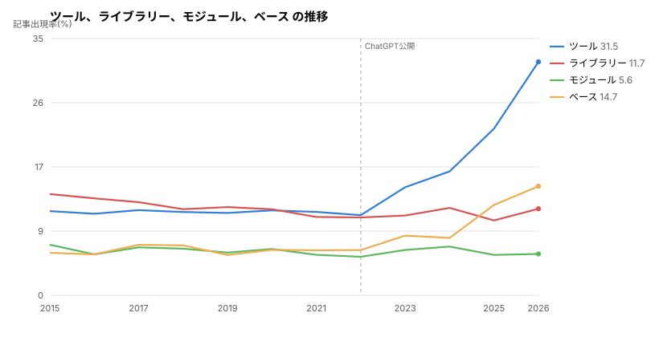

# 生成AIより先に、日本語が変わっていた — Qiita 81万記事を15年分測った話

## はじめに

[生成AI以前と以後でエンジニアの文章はどう変わったのか: Qiitaの7万記事を数えてみた話](https://nyosegawa.com/posts/qiita-writing-before-after-ai/)
という記事を読みました。逆瀬川さん(@gyakuse)が Qiita の記事を年ごとに集計して、
地の文が約2倍、太字が約3倍、箇条書きが1.8倍に増えたことを示したものです。

面白かったので、自分でも数えてみることにしました。同じ結論が出るなら追試になるし、
違う結論が出るならそれはそれで意味がある。

やってみると、元記事の主要な発見はほぼ再現できました。そのうえで、
**元記事では扱われていない数字**がいくつか出ています。この記事はその報告です。

先に断っておくと、これは「生成AIのせいで日本語が乱れた」という話ではありません。
測った結果、AIでは説明のつかない変化が混ざっていたというだけの話です。

結論を先に5つ書きます。

1. 文のリズムを表す指標が、ChatGPT の公開より**3か月早く**折れている
2. 「AIっぽい」とされる表現の多くは、実測では**減っている**
3. 記事単位で AI 判定をしようとしたが、成立しなかった
4. **2026年に2度目の変化が起きている。** 2年ぶんの変化が7か月で進んだ
5. 指標が動き出した時期は**2022年から2026年までばらけている**

## 何をどう測ったか

### データの取得

Qiita API v2 で各年8月の記事を取得しました。API には `page` が最大100、
`per_page` も最大100という制約があり、1クエリで1万件しか取れません。
12月は月13,000〜19,500件あるので月単位では取りこぼします。そこで日単位で取得しました。

8月に固定したのは、12月のアドベントカレンダーのような特異な月を避けるためです。
実際に数えると、12月は6月の1.5〜2.2倍の記事数があります。

| 年 | 6月 | 12月 | 比 |
|----|-----|------|-----|
| 2019 | 9,671 | 18,465 | 1.91倍 |
| 2022 | 7,405 | 15,405 | 2.08倍 |
| 2025 | 9,312 | 19,536 | 2.10倍 |

7年間ずっとこの傾向です。普段書かない人が書くぶん書き手の層が変わるので、
季節性を揃えないと比較になりません。

### 前処理

Markdown を行ごとに見ていって、コードブロック・表・見出し・箇条書き・引用は数えません。
残った**地の文**が対象です。測りたいのは文章のほうなので。

文の切れ目は句点と行末で判断します。読点で終わる行は、次の行とつなげてます。
形態素解析は fugashi + unidic-lite を使いました。macOS の arm64 環境でも
Homebrew の mecab なしで動くのが決め手です。

### 除外基準

以下を分析対象から外しました。

- 地の文が300字未満(コードを貼っただけの記事が多い)
- 日本語文字が地の文の30%未満(英語記事)
- 日本語文字そのものが200字未満
- スライドモードの記事(文章構造が別物)
- 文数が5未満
- タイトルに「備忘録」「メモ」を含む記事

除外率は年によって9〜33%でした。落とした記事も理由付きで保存してあります。
基準が厳しすぎないか、あとから検証できるようにするためです。

実際、途中で一度基準を緩めています。「地の文に対してコードが多すぎる記事」を
除外する規則を入れたのですが、落ちた66本を読んだら
「◯◯を作ってみた」「◯◯できるようにする」という普通の解説記事でした。
技術記事はコードが多くて当たり前なので、この規則は削除しました。

| 年 | 分析対象 |
|----|---------|
| 2019年8月 | 5,830本 |
| 2020年8月 | 6,952本 |
| 2021年8月 | 5,326本 |
| 2022年8月 | 4,461本 |
| 2023年8月 | 4,667本 |
| 2026年8月 | 10,264本 |

これとは別に、2019年3〜7月と、2015〜2018年・2024〜2025年の8月も測っています。
8月だけで合計 **49,739本**です。

さらにその後、2011年1月から2026年8月までの全期間を取得しました。
条件を満たした本文は **811,379本**、189か月分あります。
記事の後半は、この全期間のデータで測っています。

### 指標

文体の指標として主に次を使いました。

**文長のばらつき** という指標を主に使います。
`(標準偏差 - 平均) / (標準偏差 + 平均)` で計算し、値は -1 から +1 に収まります。
低いほど文が同じ長さで並んでいる。日本語の文章ではだいたい -0.2 〜 -0.3 に来ます。

言葉だと伝わりにくいので、同じ内容を2通りに書いてみます。

低い例(全部が似た長さ):

> 設計の検証を実施しました。複数の課題が明確になりました。運用面でも影響が生じます。対応が必要となります。

高い例(長短が混ざる):

> ビルドが遅い。変更の影響範囲が広いときほど待ち時間が伸びていき、手元では次の作業に移れないまま結果を待つことになるので、生産性に直結する問題になっていました。

後者は7字の文と70字の文が隣り合っています。この**落差**が読みやすさを作る。
前者は内容が悪いわけではないのに、読んでいて単調に感じます。

注意すべきなのは、**低いからといって全部短く切ると悪化する**ことです。
これは自分でやらかしました。後述する変換プロンプトの検証で、
単調だと指摘された文章を直そうとして全部の文を短くしたところ、
平均文長が参照分布の p22 から p10 へ、文のメリハリも p16 から p10 へ、
どちらも悪化しています。短く揃えても、揃っていることに変わりはない。
長い文をさらに長くして落差を作り直したら、平均文長は p50 に戻りました。

この指標は [coji さんの natural-japanese](https://github.com/coji/natural-japanese)
(MIT)から借りました。もとは時系列解析で「イベントの発生が均等か、
かたまっているか」を測る概念です。

閾値 -0.24 も同スキルの値ですが、汎用のビジネス文書で校正されたものでした。
技術記事で妥当かを確かめたのがこの分析の出発点です。
結果は後述しますが、2020年の Qiita 記事の中央値が -0.234 で、
ほぼそのまま使えると分かりました。

**MTLD** は語彙の多様性です。TTR(異なり語数 / 総語数)と違って
文書の長さに影響されにくいのが特徴で、長さが変わる比較ではこちらを見ます。

ほかに漢字率、体言止め率、1文あたりの読点数、太字の密度、箇条書きの割合、
段落あたり文数のばらつきなどを測っています。

## AI以前は、驚くほど動かなかった

比較には物差しが要ります。「2026年は2020年と違う」と言うためには、
**そもそも普段どれくらい動くのか**を知らないといけない。

そこで先に、2019年3月から8月までの6か月を月単位で測りました。

| 月 | 記事数 | 文長のばらつき | 漢字率 | 体言止め | MTLD |
|----|-------|-----------|-------|---------|------|
| 2019-03 | 5,727 | -0.233 | 0.172 | 0.151 | 43.79 |
| 2019-04 | 5,755 | -0.234 | 0.172 | 0.155 | 43.81 |
| 2019-05 | 5,888 | -0.234 | 0.172 | 0.150 | 43.75 |
| 2019-06 | 6,078 | -0.237 | 0.173 | 0.150 | 43.94 |
| 2019-07 | 5,993 | -0.234 | 0.172 | 0.154 | 43.82 |
| 2019-08 | 5,830 | -0.235 | 0.172 | 0.154 | 43.68 |

漢字率が6か月で **0.001** しか動いていません。文長のばらつきも 0.004 の幅。
毎月5,700本以上を集計した中央値が、ここまで安定している。

翌年も同じでした。2020年8月は 文長のばらつき -0.234、漢字率 0.174、体言止め 0.155。
1年空けても2019年の範囲にすっぽり収まります。

この安定が、後の判定で効いてきます。

### ただし、漢字率だけは話が違った

あとで全期間(2011〜2026年、189か月)を測り直したとき、
この「安定」の読み方を1つ間違えていたことが分かりました。

| 年 | 漢字率 |
|----|--------|
| 2013 | **0.152** |
| 2015 | 0.160 |
| 2017 | 0.167 |
| 2019 | 0.173 |
| **2020** | **0.176** |
| 2023 | 0.180 |
| 2026 | **0.220** |

漢字率は2013年から14年間ずっと上がり続けています。
2019年の6か月が動かなかったのは事実ですが、長い目で見ると
2020年はすでに上昇の途中でした。

つまり漢字率については「AI以前は動かなかった」と言えません。
基準として使うなら、この上昇ぶんを差し引いて読む必要があります。

一方で、文長のばらつきと体言止めは本当に動いていませんでした。

| 指標 | 2013〜2021の幅 | 2022 | 2026 |
|------|--------------|------|------|
| 文長のばらつき | **-0.243 〜 -0.234** | -0.253 | -0.259 |
| 体言止め | **0.133 〜 0.158** | 0.133 | 0.072 |

9年間ほとんど動かず、2022年に折れる。
文長のばらつきは**9年で幅0.009**です。
毎年5,000〜90,000本を集計した中央値がこの範囲に収まります。

### 「使う人の割合」でも同じ年に折れる

中央値だけだと「一部の記事が引っ張っただけ」という説明が残ります。
そこで**体言止めを1回も使わない記事の割合**を数えました。
中央値とは独立した測り方です。

| 年 | 使わない割合 | 体言止めの中央値 |
|----|------------|----------------|
| 2013 | 17.4% | 0.133 |
| 2015 | 15.4% | 0.139 |
| 2017 | 13.8% | 0.136 |
| 2019 | 12.2% | 0.143 |
| **2021** | **10.3%** | **0.158** |
| 2022 | 11.7% | 0.133 |
| 2024 | 14.5% | 0.122 |
| 2026 | **18.8%** | **0.072** |

**2013年から2021年まで8年間ずっと下がり続け、2022年に反転します。**
体言止めを使う書き手が増えていたのが、使わない方向に変わった。

中央値も、使う人の割合も、文長のばらつきも、頂点は**すべて2021年**。
測り方の違う3つが同じ年を指しています。

この記事の中心的な主張は、16年分で見るとむしろ強まりました。

## 閾値は結果を見る前に決めた

「変わった」と言うには線引きが要ります。ただし結果を見てから線を引くと、
都合のいい場所に引いてしまう。

そこで2021年以降のデータを取得する**前に**、AI以前の月次変動幅の3倍を閾値として
固定し、ファイルに保存しました。

| 指標 | 2019年の変動幅 | 閾値(幅の3倍) |
|------|--------------|--------------|
| 漢字率 | 0.001 | 0.004 |
| 文長のばらつき | 0.005 | 0.014 |
| 体言止め | 0.005 | 0.016 |
| 地の文字数 | 47字 | 141字 |
| MTLD | 0.260 | 0.876 |
| 読点/文 | 0.023 | 0.069 |

「AI以前の月ごとのゆらぎの3倍を超えたら、ゆらぎでは説明できない」という基準です。

## 判定結果

◯ が閾値内、● が閾値超えです。

| 指標 | 基準 | 2019 | 2020 | 2021 | 2022 | 2023 | 2026 |
|------|------|------|------|------|------|------|------|
| 地の文字数 | 968.8 | 990 ◯ | 993 ◯ | 1,058 ◯ | 1,061 ◯ | **1,169 ●** | **2,036 ●** |
| 漢字率 | 0.172 | 0.172 ◯ | 0.174 ◯ | 0.176 ◯ | 0.176 ◯ | **0.181 ●** | **0.231 ●** |
| 文長のばらつき | -0.235 | -0.235 ◯ | -0.234 ◯ | -0.233 ◯ | **-0.257 ●** | **-0.260 ●** | **-0.287 ●** |
| 体言止め | 0.152 | 0.154 ◯ | 0.155 ◯ | 0.167 ◯ | 0.143 ◯ | **0.131 ●** | **0.048 ●** |
| 読点/文 | 0.501 | 0.515 ◯ | 0.524 ◯ | 0.516 ◯ | 0.545 ◯ | **0.603 ●** | **0.879 ●** |
| MTLD | 43.80 | 43.68 ◯ | 43.11 ◯ | **42.58 ●** | 43.31 ◯ | 43.24 ◯ | **53.03 ●** |
| 箇条書き | 0.036 | 0.041 ◯ | 0.000 ◯ | 0.000 ◯ | 0.033 ◯ | 0.054 ◯ | **0.205 ●** |
| まとめ見出し | 0.000 | 0.000 ◯ | 0.000 ◯ | 0.000 ◯ | 0.000 ◯ | 0.000 ◯ | **1.000 ●** |

閾値を超えた最初の年をまとめると、こうなります。

| 年 | 指標 |
|----|------|
| 2021 | MTLD(ただし2026年と逆方向) |
| **2022** | **文長のばらつき** |
| **2023** | 地の文字数、漢字率、体言止め、読点/文 |
| 2026 | 箇条書き、まとめ見出し |

2023年8月に4指標が一斉に超えています。ChatGPT の公開は2022年11月なので、
その9か月後にあたります。

問題はその手前です。

## 文長のばらつきが折れたのは、AI公開より前だった

年ごとの推移を見ていきます。

| 年 | 文長のばらつき | 基準との差 | 判定 |
|----|--------------|-----------|------|
| 2019年3〜8月 | -0.233 〜 -0.237 | 幅 0.004 | ◯ |
| 2020-08 | -0.234 | +0.001 | ◯ |
| 2021-08 | -0.233 | +0.002 | ◯ |
| **2022-08** | **-0.257** | **-0.022** | ● |
| 2023-08 | -0.260 | -0.025 | ● |
| 2024-08 | -0.265 | -0.030 | ● |
| **2025-08** | **-0.239** | **-0.004** | **◯** |
| 2026-08 | -0.287 | -0.052 | ● |

3年半ほとんど動かなかった値が、2022年8月に 0.022 動いています。
ChatGPT の公開は2022年11月なので、この変化は3か月前に起きたことになる。

しかも単調ではありません。2022〜2024で下がり、2025でいったん基準内に戻り、
2026で再び下がる。AI の普及が単調に進むなら指標も単調に動くはずなので、
この形は単一の原因では説明しにくい。

### 8月だけの偶然かを確かめた

ここまでは各年の8月しか見ていません。8月にたまたま低い月が来ただけ、
という可能性が残ります。そこで2022年の他の月も測りました。

| 月 | 記事数 | 文長のばらつき | 基準差 | 判定 | ChatGPT公開との関係 |
|----|-------|--------------|--------|------|-------------------|
| 2021-08 | 5,326 | -0.233 | +0.002 | ◯ | 前年 |
| 2022-02 | 4,810 | -0.244 | -0.009 | ◯ | 9か月前 |
| **2022-05** | 4,749 | **-0.256** | **-0.021** | **●** | **6か月前** |
| 2022-08 | 4,461 | -0.257 | -0.022 | ● | 3か月前 |
| 2022-11 | 5,325 | -0.259 | -0.024 | ● | 公開月 |
| 2023-08 | 4,667 | -0.260 | -0.025 | ● | 9か月後 |

偶然ではありませんでした。むしろ**8月より前から動いています**。
5月の時点ですでに閾値を超えていて、2月も -0.244 と基準から離れ始めている。

つまり「2022年8月に折れた」という見方は間違いで、
実際には2022年の前半から滑らかに下がり続けていました。
8月に断絶があるように見えたのは、8月しか測っていなかったからです。

### 他の指標は公開月から動いた

ついでに他の指標も月次で見ると、別のことが分かりました。

| 指標 | 2021-08 | 2022-02 | 2022-05 | 2022-08 | 2022-11 |
|------|---------|---------|---------|---------|---------|
| 体言止め | 0.167 | 0.154 | 0.141 | 0.143 | **0.125 ●** |
| 地の文字数 | 1,058 | 1,042 | 1,057 | 1,061 | **1,119 ●** |
| 漢字率 | 0.176 | 0.173 | 0.175 | 0.176 | **0.179 ●** |

体言止めと地の文字数は、8月時点では基準内でした。
それが 11月に閾値を超えています。ChatGPT が公開された月です。

年単位(8月比較)では2023年に動いたように見えていた変化が、
月次で見ると2022年11月から始まっていたことになります。

まとめると、こうなります。

- **文長のばらつき**: 2022年前半から下降。AI 公開より早く、説明がつかない
- **体言止め・地の文字数・漢字率**: 2022年11月から動く。公開月と一致する

同じ2022年でも、指標によって動き出す時期が違いました。

### 分かっていないこと

文長のばらつきが2022年前半から下がった理由は、まだ説明できません。

Qiita の編集画面やテンプレートが変わった可能性。記事ジャンルの構成が動いた可能性。
GitHub Copilot が2021年6月に一般公開されていて、コード補完とはいえ
書く体験そのものを変えた可能性。

**どれも検証していません。** ここは未解決のまま残します。

### 説明を2つ試して、どちらも外れた

数字がおかしいときは、まず自分の集計を疑うのが筋です。

記事の構成が変わったのでは。 長い記事が増えれば、それだけでこの指標は動きます。
そこで地の文の長さで層に分けて、同じ長さの記事どうしで比べ直しました。

| 地の文の長さ | 2021 | 2022 | 差 |
|------------|------|------|-----|
| 300-600字 | -0.239 | -0.281 | -0.042 |
| 600-1000字 | -0.222 | -0.261 | -0.039 |
| 1000-1600字 | -0.236 | -0.249 | -0.013 |
| 1600-3000字 | -0.234 | -0.247 | -0.013 |

4つの層すべてで下がっていました。長さを揃えても差が残ります。

書き手が入れ替わったのでは。 Qiita から [Zenn](https://zenn.dev/) へ移った
書き手は多く、記事数は2021年の5,326本から2022年は4,461本へ減っています。

そこで2021年と2022年の**両方に投稿している著者**を抜き出しました。367人います。
この人たちだけを追うと、指標は -0.238 から -0.254 へ下がり、
58%の人が前年より低くなっていました。同じ人が、前の年と違う書き方をしている。

## 元記事の発見は再現できた

元記事(2019-2022 → 2026年8月)と、この分析(2020年8月 → 2026年8月)を見比べます。
基準年が違うので絶対値はずれますが、方向と桁を見てください。

| 指標 | 元記事 | 本分析 |
|------|--------|--------|
| 地の文 | 2倍 | 1.92倍 |
| 太字 | 3倍 | 2.39倍 |
| 箇条書き | 1.8倍 | 1.96倍 |
| 漢字割合 | 19.0→24.4% | 18.1→23.4% |
| です・ます | 50→66% | 41.8→58.0% |
| 「まとめ」見出し | 12→52% | 23.4→66.3% |
| ダッシュ | 10倍 | 19.8倍 |
| 平均文長 | 35.4→39.2字 | 35.7→38.3字 |

すべて一致しました。別実装・別の基準年で再現できたことになります。

## 別の説明を3つ試した

「文体が変わった」と言うには、別の説明で片付かないことを示す必要があります。

### 1. 毎年変わっているだけでは

前述のとおり、AI以前(2019年3〜8月)の月次変動は漢字率 0.001、文長のばらつき 0.005。
2026年との差はその **11〜39倍**です。

| 指標 | 2019年の変動幅 | 2026年との差 | 比 |
|------|--------------|------------|-----|
| 漢字率 | 0.001 | +0.059 | 39倍 |
| MTLD | 0.26 | +9.23 | 35倍 |
| 地の文字数 | 47字 | +1,067字 | 23倍 |
| 体言止め | 0.005 | -0.105 | 20倍 |
| 文長のばらつき | 0.005 | -0.052 | 11倍 |

さらに、2019→2021(すべてAI以前)の動きは2026年と**方向が違います**。

| 指標 | 2019→2021 | 2021→2026 |
|------|-----------|-----------|
| 体言止め | **+0.013**(増加) | **-0.119**(激減) |
| MTLD | **-1.10**(減少) | **+10.45**(急増) |

どちらも反転している。元の傾向を延長しても2026年の値には届かず、反対側に行きます。

### 2. AI が記事の題材になっただけでは

AI に言及する記事の割合は 27.0%(2020年) から 59.2%(2026年) へ倍増しています。
語彙を素朴に測ると「エージェント」「モデル」「プロンプト」が上位に並ぶ。
これは文体ではなく話題の変化です。

そこで AI に言及する記事を**全部除いて**測り直しました。

| 指標 | 全記事 | AI話題を除く |
|------|--------|------------|
| 漢字割合 | +1.01 | +0.97 |
| まとめ見出し | +1.01 | +0.97 |
| MTLD | +1.03 | +0.86 |
| 体言止め | -0.68 | -0.65 |
| 太字/千字 | +0.57 | +0.52 |

(数値は2020年の標準偏差で標準化した差)

ほぼ同じ大きさで残りました。語彙側も AI 関連語が消え、
「設計」「整理」「判断」「実務」といった概念語だけが残ります。

### 3. 書き手が入れ替わっただけでは

2020年と2026年の**両方に投稿している著者128人**だけを追いました。

| 指標 | 2020 | 2026 | 差(SD) |
|------|------|------|--------|
| 地の文字数 | 1,612 | 2,587 | +0.75 |
| まとめ見出し | 27.3% | 52.3% | +0.58 |
| MTLD | 44.06 | 48.32 | +0.52 |
| 漢字割合 | 0.179 | 0.203 | +0.51 |
| 体言止め | 0.174 | 0.105 | -0.43 |
| 文長のばらつき | -0.231 | -0.275 | -0.42 |

全8指標が全体集計と同じ方向に動いていました。同じ人が、6年前と違う書き方をしている。

## 測って外れた通説

予想と逆だったものを挙げます。

### 「〜することができます」は減っていた

AI っぽい表現の代表として挙げられますが、実測では千字あたり
**0.077 から 0.011 へ、7分の1**に減っていました。

| 表現 | 2020 | 2026 | 倍率 |
|------|------|------|------|
| 〜することができます | 0.077 | 0.011 | **0.14倍** |
| 以下のように | 0.061 | 0.017 | 0.27倍 |
| 〜してみましょう | 0.014 | 0.004 | 0.31倍 |
| それでは | 0.007 | 0.002 | 0.30倍 |
| 〜を行う | 0.091 | 0.054 | 0.59倍 |

定型として認識された表現は、書き手が避けるか、モデル側が直しているのだと思います。
元記事でも「しましょう」が減っていたので、同じ構図です。

### 体言止めは、ゼロのほうがAI的だった

多用が AI っぽいとされますが、逆でした。2020年の技術記事は文の **19.0%** が体言止め。
2026年は **8.3%** まで落ちています。

coji さんの計測でも人間60% / AI 0% という結果が出ていて、独立した2つの調査が
同じ方向を指しました。

### 体言止めは「短く切る」技法ではなかった

ついでに、体言止めが実際にどう使われているかも調べました。
2,000本から実例を抜き出したところ、直前の文より短いのは36%だけ。
平均はむしろ長い(27.6モーラ → 32.7モーラ)。

長い説明を最後まで書いて言い切る使い方が主流です。

> NetFlow は、シスコ社が開発したトラフィックの詳細情報を収集するための技術。

置く位置も決まっていませんでした。段落の冒頭31.8%、中間35.8%、末尾32.5%でほぼ均等。

この抽出には手間がかかりました。素朴に「名詞で終わる文」を数えると、
Markdown の見出し(`#まとめ`)や箇条書き、コードの残骸が大量に混ざります。
最初の実装では抽出結果の23%が8モーラ未満の断片で、文末語の上位が
「作成」「設定」「クリック」という手順語でした。
フィルタを3段階かけて 7,160文 → 2,507文 → 1,521文まで絞っています。

### 増えたのは翻訳調の骨組み

逆に増えたものもあります。

| 構文 | 英語の型 | 2020 | 2026 | 倍率 |
|------|---------|------|------|------|
| 重要なのは〜 | What matters is | 0.002 | 0.020 | **12.6倍** |
| ここで重要 | Here, it is important | 0.001 | 0.005 | 7.5倍 |
| 一方で〜 | On the other hand | 0.009 | 0.064 | 7.0倍 |
| つまり〜 | In other words | 0.013 | 0.053 | 4.0倍 |

(千字あたりの出現数)

記事単位で見ると、「重要なのは」を含む記事は 0.75% から 10.79% へ14倍。
2026年は10本に1本がこの型を使っています。
「という点です」(the point that の直訳)も 0.57% から 4.68% へ。

正直に書くと、この分析の途中で自分が書いた報告文にも
「結果は◯◯です」という型が出ていました。The result is X の直訳です。
指摘されるまで気づいていませんでした。

なお「一方で」「つまり」は増えていますが、実例を見ると逆接・言い換えとして
正当に使われています。増えたからといって禁止すると、正当な用法まで潰します。
「増えた」と「直すべき」は別です。

## 語彙はどう動いたか

対数オッズ比(informative Dirichlet prior)で測りました。
単純な頻度差だと低頻度語がノイズで上位に来るので、事前分布で平滑化しています。

AI に言及する記事を除いた部分集合での結果です。



**増えた語**

| 語 | 2020 | 2026 | 倍率 |
|----|------|------|------|
| 設計 | 5.5% | 33.9% | 6.2倍 |
| 整理 | 3.2% | 26.9% | 8.5倍 |
| 判断 | 4.2% | 24.1% | 5.7倍 |
| 検証 | 6.0% | 23.8% | 4.0倍 |
| 運用 | 4.5% | 22.9% | 5.0倍 |
| 安全 | 2.7% | 21.1% | 7.8倍 |
| 実務 | 0.9% | 14.4% | **15.9倍** |
| 経路 | 0.9% | 10.5% | **11.8倍** |

**減った語**

| 語 | 2020 | 2026 | 倍率 |
|----|------|------|------|
| 下記 | 17.7% | 4.2% | **0.2倍** |
| 上記 | 21.5% | 8.7% | 0.4倍 |
| 感じ | 18.6% | 7.7% | 0.4倍 |
| 参考 | 32.0% | 15.5% | 0.5倍 |
| インストール | 23.2% | 13.7% | 0.6倍 |
| クリック | 13.6% | 8.8% | 0.6倍 |

減った側は**操作の語**、増えた側は**概念の語**です。
記事の重心が「手順の記録」から「設計や判断の記述」へ移っています。

元記事と同じ構図ですが、「下記」の激減(0.2倍)は元記事にない発見でした。
話題と無関係な純粋な文体語で、ここまで落ちたものは他にありません。

## いいねが多い記事は何が違うのか

せっかくなので、いいね数と文体の関係も見ました。

**2020年8月**

| 群 | 件数 | いいね中央 | 地の文 | 漢字率 | 文長のばらつき | 見出し数 |
|----|------|-----------|-------|-------|-----------|---------|
| 上位2% | 139 | 193 | **2,605** | 0.183 | -0.245 | **10** |
| 中央付近 | 300 | 2 | 896 | 0.170 | -0.244 | 5 |
| いいね0-1 | 600 | 1 | 914 | 0.174 | -0.235 | 4 |

**2026年8月**

| 群 | 件数 | いいね中央 | 地の文 | 漢字率 | 文長のばらつき | 見出し数 |
|----|------|-----------|-------|-------|-----------|---------|
| 上位2% | 205 | 32 | 2,573 | 0.228 | **-0.262** | 10 |
| 中央付近 | 300 | 0 | **1,990** | 0.238 | **-0.299** | 10 |
| いいね0-1 | 600 | 1 | 2,076 | 0.229 | -0.263 | 11 |

2020年は**長さと構造化**が効いています。上位2%は地の文が2.9倍、見出しが2倍。

ところが2026年は長さの差がほぼ消えています(2,573 vs 1,990)。
みんな長く書くようになったので、長さでは差がつかなくなった。

代わりに残ったのが 文長のばらつきです。上位2%は -0.262、中央付近は -0.299。
ブートストラップで確かめると、この差の95%区間は [+0.013, +0.053] で0を含みません。
**2026年の上位記事は、文のリズムにメリハリがある。**

一方2020年の同じ検定は [-0.046, +0.004] で0を含みました。**有意ではありません。**
つまりこれは2026年固有の現象です。

ただし注意点があります。2026年はいいね0の記事が **71%**(2020年は26%)。
いいねの中央値も 2 から 0 に落ちています。母集団の性質がかなり違うので、
「リズムがいいと伸びる」と単純には言えません。

### いいね10以上で切ると、符号が逆になる

上位2%だと件数が少ないので、いいね10以上という分かりやすい線でも切ってみました。

**2020年8月**(10以上が1,227本、17.6%)

| 指標 | 10以上 | 10未満 | 差 |
|------|--------|--------|-----|
| 地の文字数 | 1,544 | 921 | **+623** |
| 見出し数 | 8 | 4 | **+4** |
| 文長のばらつき | -0.251 | -0.230 | **-0.021** |

**2026年8月**(10以上が304本、3.0%)

| 指標 | 10以上 | 10未満 | 差 |
|------|--------|--------|-----|
| 地の文字数 | 2,810 | 2,015 | +795 |
| 見出し数 | 12 | 11 | **+1** |
| 文長のばらつき | -0.265 | -0.287 | **+0.023** |

文長のばらつきの**符号が逆になっています**。

2020年は伸びる記事のほうが単調でした(-0.021)。長く書いて見出しで整理することが
効いていて、リズムは関係なかった。ブートストラップの95%区間は
[-0.033, -0.007] で0を含みません。

2026年は逆です。伸びる記事のほうがメリハリがある(+0.023)。
区間は [+0.010, +0.035] で、こちらも有意。

見出し数の差も **+4個から+1個**に縮んでいます。
みんなが長く書き、見出しで区切るようになったので、そこでは差がつかなくなった。

残ったのがリズムでした。

なお2026年はいいね10以上が **3.0%** しかありません(2020年は17.6%)。

ただしこの比較には穴があります。**データを取ったのは2026年9月14日**なので、
2026年8月の記事はまだ1か月しか経っていません。
2020年8月の記事には6年分の時間がありました。

いいね0件の記事は2020年の26.0%に対して2026年は70.5%ですが、
この差がプラットフォームの変化なのか、単に時間が足りないだけなのかを
分けられません。**いいね数を年をまたいで比べるのは避けたほうがよさそうです。**

上の表が月内の比較(上位2% vs 中央付近)になっているのは、そのためです。
同じ月の記事どうしなら、経過時間は揃っています。

## 2点の比較では、増えた理由が分からない

ここまで2020年と2026年を比べてきました。ただしこの測り方には穴があります。

たとえば「結論から書く」という表現が4倍近くに増えていたとします。
これを AI のせいだと言っていいのか。コンサルや面接で使われる PREP 法として
以前から広まっていた可能性もある。英語圏の TL;DR が浸透しただけかもしれない。

**2点しかないと、この2つを区別できません。**

そこで AI 以前の年を複数とって、傾きを見ることにしました。
以前から増えていたなら AI 以前の傾きがプラスになるはずです。

### 結論を示す表現の推移

記事出現率(%)です。ChatGPT の公開は2022年11月。

| 表現 | 2019 | 2020 | 2021 | 2022 | 2023 | 2026 | AI前/年 | AI後/年 |
|------|------|------|------|------|------|------|--------|--------|
| まとめ(見出し) | 12.51 | 12.40 | 11.03 | 12.04 | 13.91 | **42.26** | -0.16 | **+9.45** |
| つまり | 10.69 | 11.45 | 10.69 | 10.16 | 11.83 | **30.98** | -0.18 | **+6.38** |
| 結果として | 1.92 | 1.57 | 1.57 | 1.97 | 2.03 | **7.54** | +0.02 | **+1.84** |
| 結論から | 1.12 | 1.15 | 1.09 | 1.03 | 0.99 | **4.27** | -0.03 | **+1.09** |
| TL;DR | 1.80 | 0.87 | 0.75 | 0.78 | 0.66 | **3.89** | -0.34 | **+1.08** |
| まとめると | 1.61 | 1.46 | 1.32 | 1.63 | 1.72 | **4.66** | +0.01 | +0.98 |
| 一言で言うと | 0.25 | 0.25 | 0.28 | 0.24 | 0.34 | **1.83** | -0.01 | +0.50 |
| 帰結 | 0.06 | 0.01 | 0.02 | 0.02 | 0.02 | **1.13** | -0.01 | +0.37 |
| **最後に** | 4.88 | 5.37 | 5.54 | 5.51 | 5.65 | 7.02 | **+0.21** | +0.46 |
| すなわち | 1.90 | 1.47 | 1.66 | 1.87 | 1.38 | 1.48 | -0.01 | +0.03 |
| 端的に言えば | 0.28 | 0.22 | 0.14 | 0.24 | 0.25 | 0.05 | -0.02 | -0.07 |

AI 以前の傾きが、ほとんどマイナスです。2019年から2022年までは
横ばいか減少で、2026年に跳ねている。

「英語文化の流入で以前から増えていた」という説明は、少なくとも
2019年以降のデータでは支持できませんでした。

### TL;DR が分かりやすい

```
2019: 1.80% → 2021: 0.75% → 2023: 0.66% → 2026: 3.89%
```

2019年のほうが2023年より高い。いったん減ってから、5.9倍に跳ねています。

英語圏の慣習がだんだん浸透したのではなく、一度使われなくなってから
AI 以後に復活した形です。

### 「最後に」だけが違った

| 表現 | AI前/年 | AI後/年 |
|------|--------|--------|
| **最後に** | **+0.21** | +0.46 |
| すなわち | -0.01 | +0.03 |
| 端的に言えば | -0.02 | -0.07 |

「最後に」は AI の前後で同じように増えています。人間側の自然な変化で、
AI とは関係がなさそうです。

coji さんの実測でも「最後に」は人間コーパスでの誤検知の63%を占めていました。
AI 判定に使ってはいけない語だと、傾きからも確認できます。

### 2015年まで遡ると、判定が変わる

ここまでは2019年を起点にしていました。ところが Qiita は2011年からあります。
2015年まで遡ると、見え方が変わりました。

| 表現 | 2015 | 2017 | 2019 | 2022 | 2026 | AI前/年 | 判定 |
|------|------|------|------|------|------|--------|------|
| まとめ(見出し) | 9.17 | 9.71 | 12.51 | 12.04 | **42.26** | +0.411 | **以前から+加速** |
| つまり | 8.94 | 9.16 | 10.69 | 10.16 | **30.98** | +0.175 | **以前から+加速** |
| まとめると | 1.24 | 0.69 | 1.61 | 1.63 | **4.66** | +0.056 | **以前から+加速** |
| TL;DR | 0.54 | **1.33** | 1.80 | 0.78 | **3.89** | +0.034 | AI以後のみ |
| 結論から | 0.70 | 0.42 | 1.12 | 1.03 | **4.27** | +0.048 | AI以後のみ |

「まとめ」「つまり」「まとめると」の判定が変わりました。
2019年起点では「AI以後のみ」でしたが、2015年から見ると以前から増えています。

つまり2点の比較で「AI が増やした」に見えたものの一部は、
元から増えていた傾向が増幅されたものでした。

### TL;DR は2017年に跳ねている

```
2015: 0.54% → 2016: 0.57% → 2017: 1.33% → 2019: 1.80%
       → 2021: 0.75% → 2023: 0.66% → 2026: 3.89%
```

2016年から2017年で2.3倍になっています。そのあと2023年まで下がり続け、
2026年にまた跳ねる。

英語圏の慣習がだんだん浸透したのではなく、2017年ごろに一度流入して、
いったん廃れてから、AI 以後に復活した形です。

起点を変えるだけで結論が変わる。どこから測るかは、測る内容と同じくらい効きます。

### 判定を3つに分ける

同じ「増えた」でも、中身が違いました。

| 判定 | 表現 | 根拠 |
|------|------|------|
| AI 以後のみ | まとめ、つまり、結論から、TL;DR、帰結 | AI 前は横ばい/減少 |
| 人間側の変化 | 最後に | AI 前後で同じ傾き |
| 無関係 | すなわち、端的に言えば | AI 前後とも動かない |

2点の比較だと全部「増えた」で終わっていました。
傾きを見ると、増えた理由が分かれます。

## 語彙のほうは、すでに作っている人がいた

この分析を進めている途中で、
[textlint-rule-preset-ai-words-ja](https://blog.p1ass.com/posts/textlint-rule-preset-ai-words-ja/)
(p1ass さん、MIT)を教えてもらいました。
AI が書いた文章に出やすい語を検出する textlint プリセットです。

同じ源流から出発していました。p1ass さんは observation で作った50語の辞書に、
逆瀬川さんの分析を取り込んで拡張したとのことです。

こちらの手元には4.9万記事の集計があるので、**その辞書を検証してみました。**

### 収録語の45語すべてが増えていた

辞書の50語(重複を除く)のうち、集計に足る出現数があった45語です。

最初は「その語を含む記事の割合」で測っていました。これは**間違い**でした。
記事の地の文は2020年の1,636字から2026年は3,090字へ倍近くなっています。
記事が長くなれば、どの語も出現率は上がる。

そこで**千字あたりの延べ出現数**で測り直しました。上位20語です。

| 語 | 2020年 | 2026年 | 倍率 |
|---|---|---|---|
| 突き合わせる | 0.0001 | 0.0190 | **220.4倍** |
| 実測 | 0.0007 | 0.0711 | **103.0倍** |
| 線引き | 0.0002 | 0.0075 | 43.6倍 |
| 静かに | 0.0005 | 0.0155 | 30.0倍 |
| 入口 | 0.0011 | 0.0314 | 28.0倍 |
| 断定 | 0.0005 | 0.0127 | 24.5倍 |
| 帰結 | 0.0002 | 0.0039 | 22.6倍 |
| 黙って | 0.0007 | 0.0127 | 18.5倍 |
| 素通り | 0.0003 | 0.0058 | 16.8倍 |
| 破綻 | 0.0007 | 0.0112 | 16.2倍 |
| 定石 | 0.0003 | 0.0053 | 15.5倍 |
| 土台 | 0.0021 | 0.0304 | 14.7倍 |
| 道具 | 0.0032 | 0.0437 | 13.7倍 |
| 構図 | 0.0008 | 0.0102 | 13.1倍 |
| 混ざる | 0.0019 | 0.0229 | 12.1倍 |
| 核心 | 0.0010 | 0.0119 | 11.5倍 |
| 照合 | 0.0022 | 0.0256 | 11.4倍 |
| 壊れる | 0.0064 | 0.0719 | 11.3倍 |
| 効く | 0.0122 | 0.1338 | 11.0倍 |
| 経路 | 0.0094 | 0.1026 | 10.9倍 |
| **正本** | **0.0000** | **0.0098** | **新規** |

「正本」は2020年8月の7,083本に**1件も出てきません**。
2番目に少ない「帰結」でも1件です。

正規化すると倍率は縮みます。たとえば「部品」は出現率だと3.1倍ですが、
千字あたりでは1.6倍。長くなったぶんを差し引くと、そこまで増えていない。
それでも**45語中45語が増え、減った語は1つもありませんでした。**

### 増えていないはずの語で確かめた

45語すべてが増えたとき、疑うべきは「測り方が間違っている」ほうです。
正規化しそこねていれば、どの語も増えて見える。

そこで**辞書に入っていない一般的な技術語**を、同じ方法で測りました。

| 語 | 2015年 | 2020年 | 2026年 |
|---|---|---|---|
| 設定 | 1.111 | 1.050 | **0.608** |
| 以下 | 0.960 | 1.066 | **0.415** |
| 使用 | 0.361 | 0.646 | **0.242** |
| 追加 | 0.503 | 0.465 | 0.290 |
| 確認 | 0.535 | 0.620 | 0.935 |

8語のうち5語が**減っています**。

これで測り方の問題ではないと言えます。むしろ一般語が薄まる中で
辞書の語だけが増えているので、実際の差はこの表よりも大きい。

観察から作った辞書が、実測と一致しました。

こちらが独立に見つけた「実測」(103.0倍)「経路」(10.9倍)とも重なります。
別々のやり方で同じ語にたどり着いています。

### 検出性能を7年分で測った

各年8月から200本ずつ無作為に選んで、何%の記事が指摘されるかを見ます。

| 年 | preset-ai-words-ja | こちらの構文ルール |
|----|-------------------|------------------|
| 2015 | 17.0% | **3.5%** |
| 2018 | 22.0% | 5.5% |
| 2020 | 17.5% | **6.5%** |
| 2022 | 19.0% | 6.0% |
| 2024 | 21.0% | 11.5% |
| 2025 | 28.0% | 13.0% |
| 2026 | **73.0%** | **15.0%** |

語彙だけで73%を拾えるのは強力です。

ただし**2015年で17.0%出ています**。生成AIが存在しない年です。
何が発火させているのかを見ると、こうでした。

| 語 | 発火した記事(2015年8月 2,065本) |
|----|------------------------------|
| 走る | 58本 (2.8%) |
| 効く | 44本 (2.1%) |
| 部品 | 24本 (1.2%) |
| 壊れる | 24本 (1.2%) |

「プロセスが走る」「キャッシュが効く」「部品として切り出す」。
技術記事では普通の日本語です。

これは辞書の欠陥ではありません。感度が高いぶん、
AI以前の記事にも反応するということです。

役割が違うので、併用するのがよさそうです。

| | preset-ai-words-ja | こちら |
|---|---|---|
| 見るもの | 個々の語(51件) | 文の組み立て |
| 例 | 実測、経路、核心、土台 | 重要なのは、〜という点です、我々は |
| 強み | 感度が高い | 誤検知が低い |

```json
{
  "rules": {
    "preset-ai-words-ja": true,
    "qiita-tech-style": true
  }
}
```

### この記事は89件引っかかった

正直に書くと、この記事を preset に通したら89件出ました。
ただし中身を見ると、大半は直せません。

| 語 | 件数 | どこに出るか |
|----|-----|------------|
| 実測 | 13 | 手法の説明。言い換えると意味が変わる |
| 効く | 8 | 「プロンプトが効く」など |
| 経路 | 7 | **測定結果を載せた表そのもの** |
| 正本 | 5 | 「2020年に1件も出ない語」として挙げた箇所 |

禁止語を扱う記事を書くと、その語を使わざるを得ない。
「正本は2020年に0件だった」と書くには「正本」と書くしかありません。
coji さんも同じ現象に触れていました。機械は言及と使用を区別しません。

### いつ増え始めたのかを月ごとに見た

2020年と2026年を比べただけでは「いつ」が分かりません。
年ごとに並べると、こうなりました(千字あたり)。

| 語 | 2015 | 2019 | 2022 | 2025 | 2026 |
|----|------|------|------|------|------|
| 効く | 0.019 | 0.018 | 0.011 | 0.010 | **0.134** |
| 経路 | 0.012 | 0.015 | 0.010 | 0.027 | **0.103** |
| 実測 | 0.001 | 0.001 | 0.001 | 0.002 | **0.071** |

**2015年から2025年まで、11年間ほとんど動いていません。**
文長のばらつきが2022年に折れたのとは、まったく別の動きです。

年単位だと「2026年に跳ねた」ようにしか見えないので、月ごとに測りました。
その語を含む記事の割合です。

| 月 | 効く | 実測 | 経路 | 入口 | 設定* |
|----|------|------|------|------|------|
| 2024-08 | 1.4% | 0.0% | 1.0% | 0.2% | 42.3% |
| 2025-01 | 1.2% | 0.1% | 1.3% | 0.2% | 43.3% |
| 2025-08 | 1.9% | 0.4% | 2.0% | 0.7% | 41.5% |
| 2025-11 | 2.9% | 0.6% | 2.2% | 1.0% | 41.7% |
| 2026-01 | 4.5% | 0.5% | 2.4% | 1.7% | 42.0% |
| 2026-03 | 6.5% | 1.6% | 4.1% | 2.5% | 44.3% |
| 2026-05 | 12.3% | 2.7% | 6.2% | 4.7% | 40.7% |
| 2026-07 | 17.3% | 5.9% | 8.6% | 5.9% | 43.5% |
| 2026-08 | **20.6%** | **8.3%** | **12.3%** | **6.1%** | 47.0% |

\* 「設定」は比較用の一般語です。

跳ねたのではなく、**2025年の半ばから連続して上がっています**。
「効く」は 1.2%(2025年1月)から 20.6%(2026年8月)へ、20か月で17倍。
その間ずっと単調に増えている。

比較用の「設定」は同じ期間で 43.3% → 47.0%。ほとんど動いていません。

## 2026年に、2度目の変化が起きていた

ここで妙なことに気づきました。

文長のばらつきや体言止めが折れたのは2022年です。
語彙が動いたのは2025年半ばから。**3年ずれている。**

「文の形が先に変わって、語の選択は後から変わったのだろう」と考えました。
一応確かめようと、取得はしていたのに処理していなかった
2026年2月〜7月を指標化しました。

読み違いでした。

| 月 | 体言止め | 読点/文 | 文長のばらつき | 「効く」 |
|----|---------|--------|--------------|---------|
| 2025-08 | 0.125 | 0.640 | -0.239 | 1.9% |
| 2026-01 | 0.111 | 0.643 | -0.235 | 4.5% |
| 2026-03 | 0.087 | 0.648 | -0.245 | 6.5% |
| 2026-05 | 0.081 | 0.714 | -0.249 | 12.3% |
| 2026-07 | 0.056 | 0.875 | -0.278 | 17.3% |
| 2026-08 | **0.048** | **0.879** | **-0.287** | **20.6%** |

**語彙も文体も、2026年の前半に同時に動いています。**
3年遅れていたのではなく、2026年に両方が一緒に動いた。

### 2022年より大きく、速い

2つの変化の大きさを比べます。

| 期間 | 体言止め | 読点/文 |
|------|---------|--------|
| 2021年8月 → 2023年8月 (2年) | -0.036 | +0.087 |
| **2026年1月 → 2026年8月 (7か月)** | **-0.064** | **+0.236** |

**2年かけて起きた変化を、7か月で上回っています。**

体言止めは0.111から0.048へ、半分以下になりました。
この記事の前半で「2022年に折れた」と書いた変化より、こちらのほうが急です。

### まずデータを疑った

7か月でこれだけ動くと、測り方のほうを先に確かめるべきです。

**取得漏れではありません。** 2026年2月から8月は、すべての日を取得済みです
(manifest が31/31日)。月の一部しか取れていない2026年1月(29/31日)と
9月(15/30日)は表から外しました。

### 別の説明を4つ試した

記事の前半で2022年の変化に対してやったのと同じことを、2026年にもやりました。
括弧は、全体の差に対してどれだけ残ったかです。

| 仮説 | 潰し方 | 体言止めの差の残り |
|------|--------|-----------------|
| AIを扱う記事が増えただけ | AI に言及する記事を全部除く | **95%** |
| 多作な人の書き方が混ざった | 著者1人につき1本に絞る | 86% |
| 新しく来た人が違う書き方 | 2月にも書いていた人だけで測る | **75%** |
| 人気記事に引きずられた | いいね数の層ごとに測る | 65〜104% |

**どの条件でも差が残ります。**

このあと分野別・記事長別・時間帯別でも確かめますが、
先に結果だけ書くと**どれも同じ方向に動いていました**。

多作な書き手については、実際の値も見ておきます。

| 月 | 体言止め(全体) | (著者1人1本) | 読点/文(全体) | (著者1人1本) |
|----|--------------|-------------|-------------|-------------|
| 2025-08 | 0.125 | 0.120 | 0.640 | 0.643 |
| 2026-08 | 0.048 | 0.056 | 0.879 | 0.851 |

傾向は変わりません。上位10人が占める割合は、むしろ2026年8月のほうが
低くなっています(10.5% → 4.9%)。書き手が増えた中での変化です。

### 同じ人が、半年で書き方を変えている

いちばん強い証拠がこれでした。
2026年2月と8月の**両方に投稿した758人**について、本人の中での変化を見ます。

| 指標 | 本人内の変化(中央値) | その方向に動いた人 |
|------|-------------------|-----------------|
| 体言止め | **-0.0249** | 減らした人 **65%** |
| 読点/文 | **+0.1245** | 増やした人 **65%** |
| 文長のばらつき | -0.0249 | 下がった人 60% |
| 漢字率 | +0.0036 | 増えた人 53% |

書き手が入れ替わったのではありません。**同じ人が半年で変えています。**

漢字率だけ53%(ほぼ五分)で、方向が定まっていません。
漢字率の上昇は新しく来た人がもたらしたもので、他の3指標とは成り立ちが違う。
これは記事の前半で見た「漢字率は2013年から一貫して上昇」とも合います。

### 記事が増えたのは、同じ人がたくさん書くようになったから

交絡を潰す過程で、別のことに気づきました。
**1人あたりの投稿数が増えています。**

| 月 | 記事/著者 | 10本以上書いた人 | 新規著者率 |
|----|---------|----------------|----------|
| 2024-08 | 2.01 | 51人 | 21.5% |
| 2025-08 | 2.22 | 68人 | 22.7% |
| 2026-02 | 2.35 | 74人 | 23.9% |
| 2026-05 | 2.70 | 154人 | 24.5% |
| 2026-08 | **3.14** | **214人** | 24.6% |

2年で1.6倍。10本以上書く人は4.2倍です。

一方、新規著者率は2024年から20〜25%で動いていません。
**新しい人が来たのではなく、同じ人がたくさん書くようになった**ということです。

では「たくさん書く人の文体が全体を引っ張った」のでしょうか。
10本以上書いた人を除いて測り直しました。

| 条件 | 2026-02 | 2026-08 | 差 |
|------|---------|---------|-----|
| 全体 | 0.100 | 0.048 | -0.052 |
| 10本以上を除く | 0.100 | 0.051 | -0.049 |
| 10本以上だけ | 0.095 | 0.043 | -0.051 |

ほぼ同じでした。**大量に書く人も、そうでない人も、同じ方向に同じ幅で動いている。**
特定の層の現象ではありません。

### 分野を問わず、一様に動いている

「特定の分野から始まったのでは」も確かめました。タグで分野に分けます。

| 分野 | 体言止めの変化 | 読点/文の変化 | 2026-08の記事数 |
|------|--------------|-------------|---------------|
| Python/ML | -0.073 | +0.213 | 1,236 |
| Web frontend | -0.088 | +0.247 | 837 |
| Web backend | -0.087 | +0.226 | 641 |
| Infra/Cloud | -0.076 | +0.158 | 1,007 |
| Mobile | -0.084 | +0.189 | 233 |
| AI/LLM | **-0.061** | +0.247 | 1,801 |
| その他 | -0.069 | +0.237 | 4,509 |

2024年8月から2026年8月への変化です。
**全分野が同じ方向に動いています。** どこかから広がったのではありません。

### AI を扱う記事がいちばん変化が小さい

意外だったのがこれです。
生成AIを扱う記事がいちばん変わりそうなものですが、
体言止めの変化は -0.061 で7分野中いちばん小さい。

記事数のほうは激増しています。

| 月 | AI/LLM の記事数 |
|----|---------------|
| 2024-08 | 258 |
| 2025-08 | 735 |
| 2026-02 | 1,049 |
| 2026-08 | **1,801** |

2年で7倍。**話題としては激増しているのに、文体の変化はむしろ小さい。**
「AIの話をする記事がAIっぽく書かれる」わけではありませんでした。

### 記事の長さ別でも同じ

「長い記事から変わったのでは」も確かめました。

| 地の文字数 | 体言止め(2024-08 → 2026-08) | 読点/文 | n(2026) |
|-----------|---------------------------|--------|--------|
| 0-800 | 0.133 → 0.077 (-0.056) | +0.084 | 1,264 |
| 800-1500 | 0.118 → 0.048 (-0.070) | +0.201 | 2,341 |
| 1500-3000 | 0.118 → 0.045 (-0.072) | +0.232 | 3,558 |
| 3000以上 | 0.111 → 0.045 (-0.066) | +0.153 | 3,101 |

全層が同じ方向に動きます。短い記事だけ読点の変化が小さい(+0.084)のは、
文が少ないぶん読点も少なく、そもそも動く幅が小さいためです。

### 時間帯でも同じ。ただし投稿時刻そのものは動いていた

「業務時間内に書かれた記事から変わったのでは」も確かめました。

| 時間帯 | 体言止めの変化 | 読点/文の変化 | n(2026) |
|-------|--------------|-------------|--------|
| 深夜0-6 | -0.079 | +0.280 | 1,118 |
| 午前6-12 | -0.066 | +0.209 | 3,128 |
| 午後12-18 | -0.076 | +0.225 | 3,080 |
| 夜18-24 | -0.077 | +0.225 | 2,938 |

全時間帯が同じ方向です。

ただし、**いつ書かれるかのほうは動いていました。**

| 月 | 平日の割合 | 午前6-12時の割合 |
|----|----------|----------------|
| 2020-08 | 66.1% | **17.7%** |
| 2022-08 | 74.0% | 20.3% |
| 2024-08 | 71.1% | 20.6% |
| 2025-08 | 67.6% | 23.3% |
| 2026-08 | 70.9% | **30.5%** |

午前の投稿が6年で1.7倍になっています。2025年後半から加速している。
平日の割合は66〜74%で安定しているので、
「休日に書く人が減った」のではなく「朝に書く人が増えた」。

時間帯別では文体に差がないので、この2つは別々の現象です。
なぜ朝の投稿が増えたのかは分かりません。

### 2022年との違いは、人気記事への届き方

同じ検証を2022年前後(2021年8月 → 2023年8月)にもかけました。

| 条件 | 体言止めの差(2022年) | (2026年) |
|------|-------------------|---------|
| 全体 | -0.036 (100%) | -0.052 (100%) |
| AI関連を除く | -0.036 (102%) | -0.050 (95%) |
| 前期にも書いた人 | -0.031 (87%) | -0.039 (75%) |
| **いいね10以上** | **-0.010 (28%)** | **-0.034 (65%)** |

どちらも交絡は潰れます。違うのは最後の行です。

2022年の変化は、いいねが多い記事には**ほとんど届いていませんでした**(28%)。
2026年は**65%**が届いている。

### それでも原因は分かりません

何が変化を起こしたのかは分かりません。挙げられるのはこのくらいです。

- 生成AIの使い方が変わった(推論モデルの普及など)
- Qiita のプラットフォーム側の変化
- 書き手が AI の文章を読んで、書き方を取り入れた

**どれも検証していません。** 対抗仮説を4つ潰しただけで、
それは「AIが原因」と同じ意味ではない。記事の前半と同じ立場です。

ただ、2022年の変化を「AIの影響」と呼ぶなら、
2026年のこれは**それより大きく、速く、人気記事にも届いている何か**です。

## 外来語が減り、和語のたとえが増えた

語彙の変化には、もうひとつ分かりやすい形があります。

増えたのは、構造や経路をたとえる和語でした。

| 語 | 2015 | 2019 | 2022 | 2026 | AI後/年 |
|----|------|------|------|------|--------|
| 仕組み | 6.15 | 7.54 | 8.33 | **36.19** | +6.97 |
| 流れ | 6.89 | 8.48 | 8.93 | **27.73** | +4.70 |
| 経路 | 0.62 | 0.90 | 1.16 | **14.56** | +3.35 |
| 境界 | 0.43 | 1.01 | 1.21 | **13.86** | +3.16 |
| 土台 | 0.12 | 0.22 | 0.38 | **6.87** | +1.62 |
| 部品 | 1.39 | 1.16 | 1.34 | **5.33** | +1.00 |

「仕組み」は **3本に1本**(36.19%)が使っています。



一方、同じものを指す外来語は11年間ずっと減っていました。

| 語 | 2015 | 2019 | 2022 | 2026 | AI前/年 |
|----|------|------|------|------|--------|
| ライブラリ | 15.40 | 13.77 | 12.82 | 14.88 | **-0.368** |
| モジュール | 8.16 | 7.57 | 6.48 | 7.49 | **-0.240** |
| SDK | 5.18 | 4.66 | 4.24 | 6.23 | **-0.135** |



2026年の値も2015年とほぼ同じ水準で、純増はわずか。
概念の語と並べると、動きの違いがはっきりします。

つまり固有の外来語は伸びず、それをたとえた和語のほうが増えている。
語彙が英語から日本語のメタファへ寄っています。

### 「収束」ではなく「多極化」だった

ここで気になったのは、これが「ばらけていた言い方が1つにまとまった」のか、
その逆なのかです。同じ概念を指す語の散らばり具合(エントロピー)を測りました。

地の文800〜1,600字の記事だけで測って、記事が長くなった影響を除いています。

| 概念 | 2015 | 2019 | 2022 | 2026 | 最頻語のシェア |
|------|------|------|------|------|--------------|
| 土台 | 0.602 | 0.946 | 1.020 | **1.689** | 91.1% → **56.9%** |
| 入口 | -0.000 | 0.738 | 1.617 | **2.007** | 100% → **43.1%** |
| 経路 | 1.744 | 1.895 | 1.902 | **2.286** | 52.7% → **32.2%** |

全部で散らばりが増えています。収束ではなく多極化でした。

いちばん鮮明なのが「入口」です。

```
2015年  エントリ 1.87%   ← これしかない(シェア100%)
2022年  エントリ 0.83 / 入口 0.13 / 入り口 0.13 / 窓口 0.13
2026年  入口 2.52 / エントリ 1.28 / 窓口 1.02 / 入り口 0.88
```

2015年は「エントリ」しか使われていませんでした。
2026年は「入口」が首位に立ち、4語が併存しています。

「土台」も同じで、**「ベース」は減っていません**(11.80 → 15.57)。
「基盤」「インフラ」「土台」が伸びた分、シェアが下がっただけです。

新しい語が古い語を追い出したのではなく、選択肢が増えた。

### 分野で分けても同じだった

「Python の記事とインフラの記事では文体が違うのでは」とも思ったので、
タグで7分野に分けて測りました。結果は、分ける必要なしでした。

| 比較 | 漢字率の差 |
|------|----------|
| 分野間(2020年、7分野) | **0.030** |
| 時代間(2020 → 2026) | **0.054** |

**時代差が分野差の約2倍。** しかも分野を揃えて比べても、全5分野で上がっていました
(Web frontend +0.061 / Mobile +0.063 / Python/ML +0.054 /
初心者 +0.048 / Infra +0.045)。

文長のばらつきの分野差はさらに小さく、-0.220〜-0.249 に収まります
(全体の中央値 -0.234)。単一のプロファイルで足ります。

## 増えた語は、何を置き換えたのか

「正本」のような語が増えたなら、以前は別の言い方をしていたはずです。調べました。

**「正本」に相当する表現**

| 表現 | 2020年 | 2026年 | 倍率 |
|------|-------|-------|------|
| 原本 | 6本 | 101本 | 16.8倍 |
| 単一の情報源 | 3本 | 77本 | 25.7倍 |
| source of truth | 3本 | 72本 | 24.0倍 |
| マスターデータ | 8本 | 49本 | 6.1倍 |
| 信頼できる情報源 | **0本** | 20本 | — |

2020年はどれも一桁でした。合計しても20本ほど。
**「正本」という語が新しいのではなく、この概念を語る記事自体がなかった**わけです。

**「帰結」に相当する表現**

| 表現 | 2020年 | 2026年 | 倍率 |
|------|-------|-------|------|
| つまり | 932本 | 3,397本 | 3.64倍 |
| その結果 | 202本 | 950本 | 4.70倍 |
| 結果として | 128本 | 827本 | 6.46倍 |

こちらは事情が違います。旧表現も一緒に増えている。
「帰結」が「結果として」を置き換えたのではありません。

「実測」も同じで、「計測」5.81倍、「ベンチマーク」12.34倍と並んで伸びています。

### 置換ではなく、話題の出現だった

つまり語彙の入れ替わりではありませんでした。
そもそも語られていなかった話題が、語られるようになった。

「唯一の情報源をどこに置くか」「実際に測ってみた」という議論が、
2020年の Qiita にはほとんどなかった。設計や検証の話が増えたという
[語彙の変化](#語彙はどう動いたか)とも重なります。

新しい語が目につくのは、新しい話題が来たからでした。

## 往復翻訳で、どの語に選択の余地があるかを測る

ここまでは Qiita の中だけを数えてきました。別の角度も試します。

日本語の記事を英語に訳し、それをまた日本語に戻す。
そのとき元の語が残るかどうかを見れば、**その語が英語と1対1で
対応しているか**が分かります。

16年分の記事から1,332件、地の文をまるごと(最大1,500字)往復させました。
翻訳には手元の LLM を使っています。

### 半分以上で、語が入れ替わった

**690件 / 1,332件 (51.8%)** で、元の語とは別の語になって戻ってきました。

### 生き残り率で、語が2層に分かれる

「往復しても同じ語が残る割合」を測ると、はっきり分かれます。

**安定している語**

| 語 | 生き残り | 件数 |
|----|---------|------|
| モジュール | **100.0%** | 51 |
| ツール | 98.8% | 167 |
| パス | 96.2% | 131 |
| コンポーネント | 96.0% | 50 |
| 確認 | 94.7% | 171 |

**不安定な語**

| 語 | 生き残り | 件数 |
|----|---------|------|
| パーツ | **20.0%** | 5 |
| 手段 | **25.0%** | 8 |
| **作り** | **48.0%** | **98** |
| 区切り | 63.6% | 11 |
| 構成 | 72.6% | 62 |
| チェック | 76.5% | 162 |

生き残り率が高い語は、英語に1対1で対応しています。
`module` を訳せば「モジュール」にしかならないので、書き手に選択の余地がない。

低い語は、日本語側に候補が複数あります。

### 「作り」が最も揺れた

98件という十分な件数で、生き残りは **48%**。2件に1件は別の語になります。

しかも行き先が定まりません。

```
作り → ベース(9) / 確認(8) / 構成(8) / 検証(8) / 仕組み(4) / 構造(4)
```

往復で消えた回数も **70回**で、2位の「ベース」24回の3倍近くあります。

英語に安定した対応物がないということです。文脈によって
`structure` にも `configuration` にも `build` にもなるので、戻すと別の語に落ちる。

これは Qiita の実データとも合います。「作り」は2015年 0.62% → 2026年 1.50% と
伸びが鈍く、AI 以前の傾きは **-0.057** とマイナスでした。
翻訳で揺れる語は、書き手からも選ばれていない。

### カタカナ語も、競合があると揺れる

外来語は概して安定しています。ただし例外がありました。

| 語 | 生き残り | 化ける先 |
|----|---------|---------|
| パーツ | **20.0%** | 部品、コンポーネント |
| チェック | **76.5%** | 確認、検証 |
| フロー | 82.1% | 流れ |

同じカタカナ語でも、日本語側に競合する和語があると不安定になります。

「チェック」が76.5%で、残りは「確認」「検証」に化ける。
実データで「確認」が大きく増えていたのと符合します。

### 双方向に行き来する

置き換えの上位を見ると、和語とカタカナ語が互いに行き来しています。

| 元の語 | 戻った語 | 回数 |
|--------|---------|------|
| 構成 | 構造 | 21 |
| チェック | 確認 | 18 |
| 流れ | フロー | 13 |
| 部品 | コンポーネント | 4 |
| フロー | 流れ | 4 |
| 道具 | ツール | 3 |
| インフラ | 基盤 | 3 |

「流れ ⇄ フロー」「確認 ⇄ チェック」が**両方向に出ています**。
翻訳器から見て等価ということで、実データで両方とも増えていたのと合います。

### 何が言えるか

生き残り率は、その語に選択の余地があるかどうかを表しています。

- 高い = 英語に1対1で対応する = 選びようがない
- 低い = 日本語側に候補が複数ある = 書き手が選んでいる

先ほど見た多極化(2015年はカタカナ語の一強 → 2026年は和語が加わる)は、
この**選択の余地がある語**で起きていました。

「入口」の概念が分かりやすい例です。2015年は「エントリ」しかなかったので
選びようがなかった。2026年は「入口」「窓口」「入り口」が加わり、
書き手が選べるようになっています。

### この手法の限界

検出しているのは**翻訳器が揺らす語**であって、AI が好んで使う語ではありません。
今回は実データの発見と独立に一致したので意味がありましたが、
単独では証拠になりません。

翻訳器のモデルが変われば結果も変わります。
1回の往復しか見ていないので、たまたまその語が選ばれた可能性も残ります。

## AI判定はやろうとして、やめた

個々の記事が AI で書かれたかを判定する機能も考えました。試して、成立しないと分かっています。

まず「AIしか使わない語」を探しました。2020年にほぼ存在せず2026年に広がった語が
83件見つかります。「実測」は 0.08% から 8.2% へ、105倍。

ところが記事単位で見ると使えません。

| 語 | AI関連記事率 | 非AI記事での出現 |
|----|------------|----------------|
| 実測 | 61% | **6.7%** |
| 根拠 | 68% | 5.3% |
| 既定 | 53% | 7.0% |
| 自律 | **88%** | 1.2% |

「実測」で判定すると、非AI記事の6.7%を誤って名指しします。1万本なら670本。

最も強かった「自律」でも同じでした。AI関連率は88%と高いのですが、
引っかかった77本を読むと「スクラム開発ガイド」「Azure SQL Database の基礎」。
自律的なチーム、自律型システム。AIとは関係のない文脈です。
そもそも AI 以前の2019年の記事にも13本ありました。

検出していたのは「AIが書いた文章」ではなく**「AIについて書いた記事」**でした。
話題の語であって、文体の語ではない。

外部の報告もあります。英語圏では非ネイティブ話者の誤検出率が61%という研究があり
(Liang et al., *Patterns* 2023)、Vanderbilt 大は Turnitin の AI 検出機能を停止、
OpenAI も自社の検出器を取り下げています。

Qiita にも日本語が母語でない書き手はいます。誤って名指しする道具は作らないことにしました。
出すのは指標値と、参照分布のどこに位置するかまでです。

## この記事自体を測った

作った lint にこの記事を通しました。検出はゼロです。

ただし「lint を知っているから避けた」結果でもあるので、何を見ているかを書いておきます。

- 文長のばらつき(変動係数と 文長のばらつき)が参照分布の下位から外れていないか
- 漢字率が上位から外れていないか
- 1文あたりの読点が多すぎないか
- 太字の密度
- 「重要なのは」「という点です」が2回以上出ていないか

閾値は AI 以前の実記事200本で校正しました。最初は参照分布の p10/p90 を
そのまま使ったところ誤検知率が23%。人間が書いた記事なので全部誤検知です。
指標ごとに裾を測り直して、最終的に **2.5%** まで下げています。
同じ閾値で2026年の記事200本を測ると **14.0%** が引っかかります。

とはいえ、lint を通ることと読みやすいことは別です。
数値を満たすために不自然な短文を挟めば、今度は別の意味で機械的になる。
指標は下限であって目標ではありません。

## 12月だけは、13年間ずっと別の月だった

冒頭で「12月はアドベントカレンダーで記事が増えるから避けた」と書きました。
全期間がそろったので、その12月を13年分あらためて測ってみます。

### 記事数は13年ずっと2〜3倍

| 年 | 12月 | 他の月の平均 | 比 |
|----|------|------------|-----|
| 2013 | 1,405 | 384 | **3.66倍** |
| 2017 | 8,790 | 2,963 | 2.97倍 |
| 2020 | 12,733 | 6,992 | 1.82倍 |
| 2022 | 11,824 | 4,721 | 2.50倍 |
| 2025 | 16,877 | 6,632 | 2.54倍 |

例外なし。避けた判断は正しかったことになります。

### 中でも1〜25日だけが違う

アドベントカレンダーは1〜25日に走ります。日別で分けると、
記事数も文体もはっきり分かれました。

| 年 | 1-25日(1日あたり) | 26-31日 | 体言止め(1-25) | (26-31) | 11月 |
|----|-----------------|---------|--------------|---------|------|
| 2016 | 292 | 109 | 0.091 | 0.133 | 0.160 |
| 2019 | 514 | 237 | 0.104 | 0.136 | 0.150 |
| 2022 | 432 | 170 | 0.103 | 0.125 | **0.125** |
| 2025 | 610 | 270 | 0.097 | 0.107 | 0.116 |

右の3列に注目してください。**26〜31日の体言止めが、11月の値とほぼ一致します。**
2022年は 0.125 対 0.125 で完全に同じ。

クリスマスを過ぎると平常月の書き方に戻る。つまり
「12月は文体が違う」ではなく「アドベントカレンダー期間だけが違う」でした。

### 普段書かない人が4割

12月の書き手を、同じ年の他の月にも投稿しているか(常連)で分けます。

| 年 | 常連 | 非常連 | 非常連率 |
|----|------|-------|---------|
| 2013 | 738 | 667 | 47.5% |
| 2019 | 8,258 | 6,005 | 42.1% |
| 2025 | 10,267 | 6,610 | 39.2% |

13年間ずっと **39.2〜47.8%**。「12月は普段書かない人が4割前後」という構図は
変わっていません。

そして非常連のほうが**長く書き、漢字が多い**。これも13年間一貫しています。
力が入っているのだと思います。

### 2022年から、常連と非常連の差が開いた

体言止めの差(常連 − 非常連)を見ると、ある年を境に変わります。

| 期間 | 平均 |
|------|------|
| 2013〜2021(9年) | **-0.0001** |
| 2022〜2025(4年) | **+0.0196** |

9年間ゼロだった差が、2022年から一貫して出ています。
常連は体言止めを使い続け、非常連が使わなくなった。

1〜25日に絞って測り直しても +0.0192 で、ほぼ変わりません。
期間の切り方によらない差です。

理由は分かっていません。全体の体言止めが2022年から下がり始めているので、
その変化が非常連に先に出た可能性はありますが、確かめていません。

## 16年分で見直すと、指標が3つに分かれた

ここまでは各年8月だけを比べてきました。最後に全期間(2011〜2026年、
189か月・81.1万件)を測り直しています。

AI以前(2013→2021、8年)と以後(2021→2026、5年)の年あたり変化を並べます。

| 指標 | 2013 | 2021 | 2026 | AI前/年 | AI後/年 |
|------|------|------|------|--------|--------|
| 読点/文 | 0.536 | 0.520 | 0.750 | -0.0019 | **+0.0460** |
| MTLD | 44.72 | 43.12 | 52.67 | -0.2006 | **+1.9100** |
| 体言止め | 0.133 | 0.158 | 0.072 | +0.0031 | **-0.0172** |
| 文長のばらつき | -0.242 | -0.234 | -0.259 | +0.0009 | **-0.0050** |
| 漢字率 | 0.152 | 0.176 | 0.220 | +0.0030 | +0.0088 |
| 地の文字数 | 719 | 1,074 | 1,642 | +44.4 | +113.6 |

3つに分かれました。

**元から動いていた指標** — 漢字率、地の文字数

どちらも2013年から一貫して増えています。AI以後に加速しますが(2.9倍、2.6倍)、
上昇そのものは10年以上前から続く傾向でした。

**方向が反転した指標** — 文長のばらつき、体言止め、MTLD

AI以前は上がっていた(あるいは横ばいだった)ものが、以後は下がる。
元の傾向を延長しても2026年の値には届かず、反対側に行きます。

**新しく動き出した指標** — 読点/文

AI以前の傾きがほぼゼロ(-0.0019)で、以後に +0.0460。

「AIで日本語が変わった」とひとまとめにはできません。
**元から動いていたものと、2022年に折れたものがあります。**

なお、この表の2026年は9か月分(1〜9月)です。前に書いたとおり
2026年前半に急変しているので、年としての値は月によって大きく違います。

### 動き出した時期も、指標ごとにばらけている

性質だけでなく、**いつ動いたか**も揃っていませんでした。
月ごとに追える指標について、変化が始まった時期を並べます。

| 指標 | 動き出した時期 |
|------|--------------|
| 体言止め・文長のばらつき | **2022年** |
| 太字 | **2024年末** |
| 辞書の語彙 | **2025年半ば** |
| 読点・地の文字数 | **2026年前半** |

太字は意外でした。2013年から2024年まで12年間、記事の6〜8割が
太字を1つも使っていません。その割合が2025年に46.2%、2026年に32.3%。

| 年 | 太字を使わない記事の割合 |
|----|---------------------|
| 2013 | 79.4% |
| 2017 | 70.3% |
| 2020 | 64.8% |
| 2022 | 66.9% |
| 2024 | 65.1% |
| **2025** | **46.2%** |
| 2026 | **32.3%** |

12年横ばいだったものが、2年で半分以下になっています。
月ごとに追うと2024年末からの連続した変化で、どこかで跳ねたのではありません。

**4年にわたって、別々の指標が別々の時期に動いています。**
ChatGPT の公開(2022年11月)を境に一度で変わったのではない。

### タイトルは、本文より遅れて動いた

ここまで本文だけを測ってきました。最後にタイトルも測ります。
タイトルは本文と違って**読まれるために書かれる**ので、別の力がかかります。

| 年 | 題の字数 | 題の漢字率 | 記号を含む | 数字を含む |
|----|---------|----------|----------|----------|
| 2013 | 28 | 0.121 | 23.7% | 22.3% |
| 2017 | 30 | 0.129 | 31.0% | 27.0% |
| 2020 | 31 | **0.143** | 41.8% | 27.2% |
| 2021 | 31 | **0.143** | 43.0% | 26.5% |
| 2022 | 31 | **0.143** | 41.8% | 27.2% |
| 2023 | 31 | **0.143** | 41.7% | 26.4% |
| 2024 | 31 | 0.154 | 42.1% | 26.6% |
| 2025 | **34** | **0.167** | **48.7%** | **30.1%** |
| 2026 | **40** | **0.190** | **51.7%** | **37.0%** |

**文字数は2013年から2024年まで12年間 28〜31字。** それが2年で40字です。

漢字率はもっとはっきりしています。
**2020年から2023年まで 0.143 で4年間まったく動きません。**
本文の体言止めが折れた2022年にも、タイトルは動いていない。

数字を含むタイトルも増えました。2015年から2024年まで26〜27%で
一定だったものが、2026年は37.0%。「3つの方法」のような数え上げが
増えたと読めますが、**中身は確かめていません**。
バージョン番号(Python 3.12 など)の増加でも同じ数字になります。

## 何がわかって、何がわからないか

### わかったこと

- Qiita の技術記事の文体は2023年に大きく動いた。ChatGPT 公開の9か月後
- その変化は、AI以前の経年変化の11〜39倍の大きさ
- 話題の変化では説明できない(AI関連記事を除いても残る)
- 書き手の入れ替わりでも説明できない(同一著者でも同じ方向に動く)
- 文長のばらつきは2022年8月に折れていて、これは AI 公開の3か月前にあたる
- **2026年前半に2度目の変化があった。** 語彙と文体が同時に動き、
  2021〜2023年の2年ぶんを7か月で上回っている
- AI語彙辞書の45語は**1語も減っていない**。比較用の一般語は5/8語が減った
- **動き出した時期は指標ごとにばらけている。** 体言止め2022年、
  太字2024年末、語彙2025年半ば、読点2026年前半。一度で変わったのではない
- **2026年の変化は分野を問わない。** 7分野すべてが同じ方向に動き、
  AI を扱う記事がむしろいちばん変化が小さかった
- **タイトルは本文より遅れて動いた。** 2013年から2024年まで12年間
  28〜31字だったものが、2年で40字になった
- 記事の長さ別・時間帯別に分けても、全層が同じ方向に動く
- **2026年の変化には、対抗仮説を8つぶつけて全部潰れた。**
  それでも原因は分かっていない

### わからないこと

**原因が生成AIだとは言えません。** ここまでやったのは、
別の説明を3つ試して、どれも合わなかったと確かめたところまでです。
「他の説明が合わない」と「AIが原因」は、同じことではない。
この6年間には AI 以外の変化も起きています
(Qiita の UI、記事ジャンルの流行、他プラットフォームとの競争)。

説明できていない変化が2つあります。2022年の文長のばらつきと、
2026年前半の急変です。後者のほうが大きいのに、原因の見当がついていません。

2021年は判定できません。 閾値の係数を3倍にしたので1指標しか超えませんが、
1倍なら5指標が超えます。感度分析の結果は次のとおりです。

| 係数 | 2019 | 2020 | 2021 | 2026 |
|------|------|------|------|------|
| 1倍 | 0/8 | 1/8 | **5/8** | 8/8 |
| 3倍 | 0/8 | 0/8 | **1/8** | 8/8 |
| 10倍 | 0/8 | 0/8 | 0/8 | **7/8** |

2026年は10倍にしても7指標が超えるので主要な結論は頑健ですが、
2021年については「判定できない」が正確です。

ほかにも限界があります。

- **語彙の測定は各年8月だけ。** 月ごとに見たのは2024年8月以降です。
  文体の指標は189か月そろっています
- **いいね数は年をまたいで比べられません。** データを取ったのは
  2026年9月14日なので、新しい記事ほど反応を集める時間が短い。
  いいねを使った比較は同じ月の中に限っています
- **「朝の投稿が増えた」理由は分かりません。** 文体とは独立に動いていて、
  何が起きたのか確かめていません
- **生存バイアス。** 2019・2020年の記事は削除されずに残ったものだけ
- **段落の定義。** Qiita では1行1段落で書く人が多く、空行区切りの定義が
  実態と合っていない疑いがある
- **中央値のみ。** 分布の形が変わっていないかは見ていない

# 終わりに

この記事は、人間と AI の分担で作りました。

調査の方向は人間が決めています。「除外基準をこう変えて」「いいね10以上で見て」
「2017年まで遡ってみて」といった指示のほか、
**当時の空気を教えてもらったことが何度も効きました。**

たとえば「2017年ごろから英語圏の書き方が入ってきた」という証言。
2019年起点で測っていたときは「AI 以後に増えた」としか見えなかった表現が、
2015年まで遡ると「以前から増えていた」に変わりました。
TL;DR が2016→2017で2.3倍になっていたのは、その証言があったから確かめた数字です。

外れた仮説もあります。「SDK を『箱』と訳すのが増えたのでは」という指摘は、
測ると SDK 系の語は11年間ずっと減っていました。
ただしそこから「固有の外来語が減り、和語のたとえが増えている」という
別の発見につながっています。

「分散していた言い方が1つに収束したのでは」という見立ても、
測ると逆でした。1語だったものが多極化していた。

仮説が外れること自体が、次の測定を決めていました。

文章そのものは AI が書いています。データの取得も、検証の設計も、
この文も。人間が書いた行は1行もありません。

AIっぽさは、どれくらい減っていたでしょうか。

もし読んでいて AI っぽさを感じなかったなら、
上に貼ったプロンプトが効いたということになります。そのまま使ってもらって構いません。
逆に「ここが AI っぽい」と感じた箇所があれば、それは指標に乗っていない特徴なので、
教えてもらえると助かります。次の校正に使えます。

実際、この記事を書いている途中でも指摘を受けました。
「burstiness という英語をそのまま使うな」「〜だけは、という言い方が AI っぽい」。
後者はその場で直さず、まず実測しています。
「〜だけは」は2020年から2026年で5.49倍、「という事実」は7.19倍に増えていました。
そこで lint のルールに足して、引っかかった箇所を直しています。
思いつきで直すと、また別の癖が入るので。

なお、この記事自体も lint に通しました。検出はゼロです。
ただし「lint を知っているから避けた」結果でもあるので、
何を見ているかは本文に書いたとおりです。

スクリプトと分析の記録は公開しています。閾値の校正データも入っているので、
別の期間やプラットフォームで試したい方はどうぞ。
