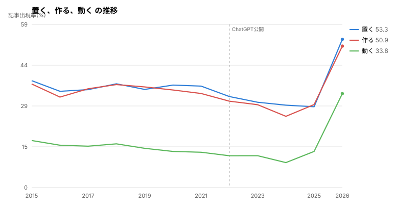

# 頻出500語の12年推移

頻度上位500語を機械的に選んで、2015〜2026年の各年8月で追跡した記録。

- 実施日: 2026-09-14
- 手法: `scripts/word_timeline.py`
- 出力: `data/processed/word_timeline.json`(全500語の年次データ)

## 記事長で正規化しても、結論は変わらなかった

記事出現率(その語を含む記事の割合)は、記事が長くなるだけで上がるはずだと考えた。

| 年 | 地の文の長さ(中央値) | 平均 |
|----|-------------------|------|
| 2020 | 993字 | 1,460字 |
| 2022 | 1,061字 | 1,809字 |
| 2026 | **2,036字** | **2,863字** |

そこで「千字あたりの延べ出現数」でも測り直した(`--normalize`)。
結果、**ほとんど変わらなかった**。

| 語 | 記事出現率の倍率 | 千字あたりの倍率 |
|----|---------------|----------------|
| 整理 | 8.42x | **8.42x** |
| 判断 | 6.90x | **7.72x** |
| 設計 | 6.41x | **5.63x** |
| 運用 | 5.35x | **4.33x** |
| 検証 | 3.96x | **4.06x** |
| 仕組み | 4.18x | **3.41x** |
| 実際 | 2.78x | **2.79x** |
| 置く | 1.63x | **1.57x** |
| 作る | 1.64x | **1.45x** |

### 前の版の記述を訂正する

以前ここに「『置く』1.63倍・『作る』1.64倍は記事が長くなっただけの
見かけの増加」と書いたが、**誤りだった**。正規化しても1.5倍前後残る。

記事出現率と千字あたりの出現数は別の指標で、片方がもう片方に収束する
という関係ではなかった。両方とも同じ方向に動いていたので、
「置く」「作る」は密度としても実際に増えていたことになる。

ただし **8倍と1.5倍という差は歴然としている**。
強弱の区別自体は正しかったので、判定の根拠を
「記事長の交絡」から「倍率そのものの差」に改める。

- 倍率 4倍以上 = 明確に増えた(整理、判断、設計、運用、検証)
- 倍率 2〜3倍  = 増えた(実際、動く、持つ、仕組み)
- 倍率 1.5倍前後 = 弱い(置く、作る)。AI以前の傾きがマイナスなので、
  2026年だけ跳ねた形

以下の表は記事出現率(%)で、正規化していない生の数字。

## グラフ

`scripts/plot_words.py` で SVG にした。点線は ChatGPT 公開(2022年11月)の位置。

### 概念の語


2022年まで横ばいで、そこから跳ねる。4〜8倍に増えた語。

### 構造をたとえる語


同じ形だが、「仕組み」「流れ」は2015年時点でも一定の割合がある。

### カタカナ語


こちらは11年間ほぼ横ばい。2026年に上がるが、2015年の水準に戻った程度。
概念の語とは動きが違う。

### 伸びが弱い語



AI 以前はむしろ減っていて、2026年だけ跳ねる。倍率は1.5倍前後にとどまる。

再生成:
```bash
./scripts/plot_words.py --preset concept
./scripts/plot_words.py --words 設計,判断 --normalize
```

## AI以後に急増した語(上位25)

スパークラインは 2015〜2026 の12年。

| 語 | 推移 | 2015 | 2026 | AI前/年 | AI後/年 |
|----|------|------|------|--------|--------|
| 実際 | ▁▁▁▁▁▁▁▁▁▂▃█ | 16.40 | 55.91 | +0.534 | +8.944 |
| 設計 | ▁▁▁▁▁▁▁▁▂▂▃█ | 3.64 | 40.66 | +0.385 | +8.580 |
| 判断 | ▁▁▁▁▁▁▁▁▁▁▂█ | 2.37 | 32.91 | +0.343 | +7.035 |
| 整理 | ▁▁▁▁▁▁▁▁▁▁▃█ | 1.95 | 30.16 | +0.233 | +6.645 |
| 扱う | ▁▁▁▁▁▁▁▁▁▁▂█ | 9.20 | 34.64 | +0.044 | +6.285 |
| 持つ | ▁▁▁▁▁▁▁▁▂▂▃█ | 15.09 | 42.71 | +0.344 | +6.304 |
| 見える | ▁▁▁▁▁▁▁▁▁▁▁█ | 6.27 | 31.64 | +0.067 | +6.223 |
| 変わる | ▁▁▁▁▁▁▁▁▁▁▁█ | 10.30 | 36.94 | +0.253 | +6.217 |
| 一方 | ▁▁▁▁▁▁▁▁▁▁▂█ | 3.26 | 29.95 | +0.297 | +6.151 |
| 仕組み | ▁▁▁▁▁▁▁▁▁▁▃█ | 5.25 | 31.79 | +0.336 | +6.047 |
| 結果 | ▁▁▁▂▂▁▂▂▂▂▃█ | 20.04 | 48.41 | +0.604 | +6.033 |
| 自体 | ▁▁▁▁▁▁▁▁▁▁▁█ | 7.42 | 31.39 | +0.003 | +5.989 |
| 運用 | ▁▁▁▁▁▁▁▁▂▁▃█ | 3.05 | 29.43 | +0.350 | +5.982 |
| 構成 | ▁▁▁▁▁▁▁▁▁▁▃█ | 9.32 | 35.80 | +0.373 | +5.967 |
| 最初 | ▁▁▁▁▁▂▁▁▁▁▂█ | 13.14 | 39.56 | +0.392 | +5.921 |
| 状態 | ▁▁▁▁▁▁▁▂▂▁▂█ | 15.59 | 43.07 | +0.583 | +5.848 |
| 全体 | ▁▁▁▁▁▁▂▂▂▂▃█ | 5.68 | 32.84 | +0.560 | +5.812 |
| 検証 | ▁▁▁▁▁▁▁▁▂▂▃█ | 4.28 | 30.61 | +0.491 | +5.721 |
| 但し | ▁▁▁▁▁▁▁▁▁▁▁█ | 8.60 | 30.75 | -0.101 | +5.715 |
| 動く | ▃▂▂▂▂▂▂▁▁▁▂█ | 16.91 | 33.78 | -0.784 | +5.592 |
| 残る | ▁▁▁▁▁▁▁▁▁▁▁█ | 2.97 | 25.38 | +0.055 | +5.506 |
| 生成 | ▁▁▁▁▁▁▁▁▂▂▄█ | 15.17 | 34.86 | -0.235 | +5.335 |
| ツール | ▁▁▁▁▁▁▁▁▂▂▄█ | 11.36 | 31.48 | -0.079 | +5.169 |
| 置く | ▃▂▂▃▂▃▃▂▁▁▁█ | 38.43 | 53.32 | -0.816 | +5.150 |
| 作る | ▄▂▃▄▃▃▃▂▂▁▂█ | 37.25 | 50.87 | -0.885 | +4.953 |

**スパークラインがほぼ全部 `▁▁▁...█` の形をしている。**
11年間ほとんど動かず、2026年だけ跳ねている。

### 「置く」「作る」「動く」は伸びが弱い

この3語は AI 以前の傾きがマイナス(-0.8前後)で、
2015年から2025年まで**ずっと減っていた**。2026年だけ跳ねているが、
倍率は1.5倍前後にとどまる(正規化しても1.45〜1.57倍)。

11年の減少を打ち消して少し上回った程度で、他の語とは性質が違う。

### 「設計」「判断」「整理」「検証」は明確

倍率が4〜8倍あり、正規化してもほぼ変わらない(整理8.42倍、判断7.72倍)。
[vocabulary-shift.md](vocabulary-shift.md) の「手順語から概念語へ」と一致する。

## 使い方

全500語のデータは `data/processed/word_timeline.json` にある。

```json
{
  "years": ["2015", ..., "2026"],
  "article_counts": {"2015": 2360, ...},
  "words": [
    {"word": "設計", "series": [3.64, ...], "pre_slope": 0.385, "post_slope": 8.580,
     "first": 3.64, "last": 40.66, "ratio": 11.17}
  ]
}
```

再実行:
```bash
./scripts/word_timeline.py --years 2015,...,2026 --top 500
```

## 未検証

- グラフの画像化(いまはスパークラインのみ)
- Google Trends など外部データとの突き合わせ。Qiita 内の頻度だけでは
  「AI が使った」のか「その技術が流行った」のかを完全には切り分けられない

## 使ったデータ

- `data/processed/word_timeline.json` — 記事出現率(%)
- `data/processed/word_timeline_norm.json` — 千字あたりの出現数

```bash
./scripts/word_timeline.py --years 2015,...,2026 --top 500              # 出現率
./scripts/word_timeline.py --years 2015,...,2026 --top 500 --normalize  # 千字あたり
```
